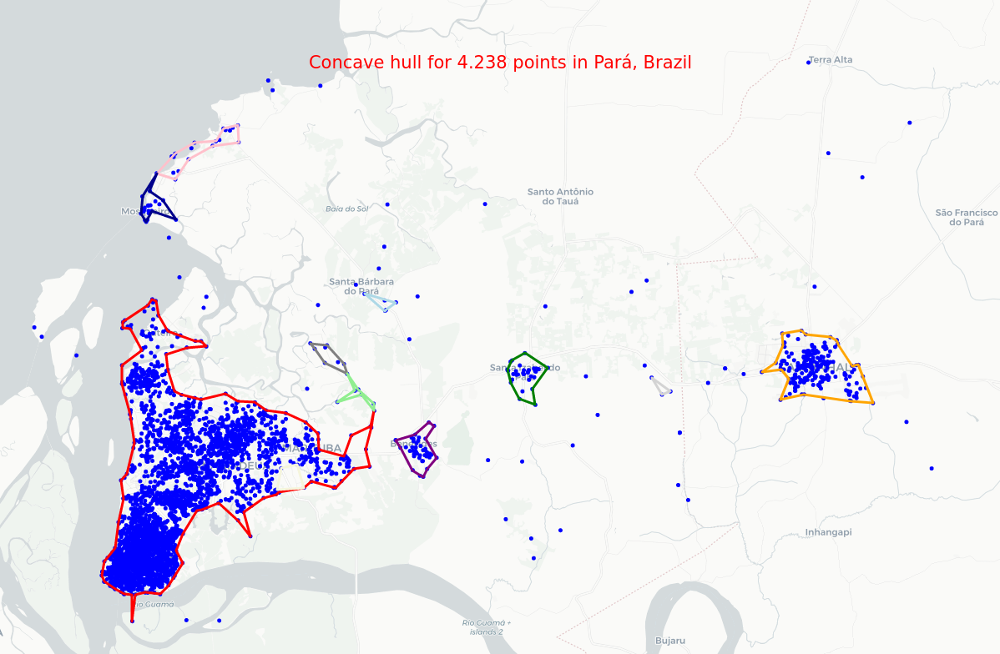
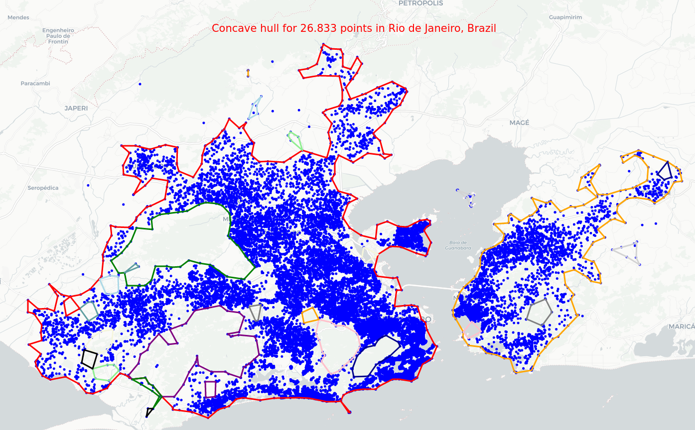

# concave_uhull*

A simple (but not simpler) algorithm for concave hull of 2D point sets using an alpha shape algorithm.

Notes
-----
  * uhull! (Brazil) yeah! (expresses joy or celebration)


# Installation

```
pip install concave_uhull
```
# Usage

You can see usage examples by checking the notebook [here](https://github.com/luanleonardo/concave_uhull/blob/main/visual_tests_concave_uhull.ipynb).

# Visual examples

* [Map of points in Brasília, Brazil](data/maps/points_brasilia_brazil.html)
  

* [Map of points in Pará, Brazil](data/maps/points_para_brazil.html)
  

* [Map of points in Rio de Janeiro, Brazil](data/maps/points_rio_de_janeiro_brazil.html)
  
