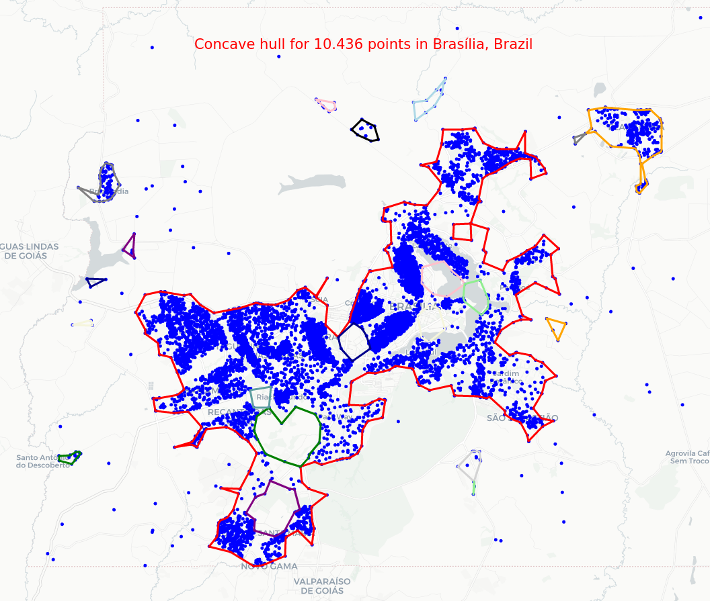

concave_uhull*
--------------

A simple (but not simpler) algorithm for concave hull of 2D point sets using an alpha shape algorithm.

Notes
-----
  * uhull! (Brazil) yeah! (expresses joy or celebration)


Visual examples
---------------

* [Interactive map of points in Brasília, Brazil](data/maps/points_brasilia_brazil.html)
  

* [Interactive map of points in Pará, Brazil](data/maps/points_para_brazil.html)
  

* [Interactive map of points in Rio de Janeiro, Brazil](data/maps/points_rio_de_janeiro_brazil.html)
  

Installation
------------

```
pip install concave_uhull
```

Usage
-----

The code that generated the above interactive maps using `concave_uhull` to get the concave hull of the points can be found [here](https://github.com/luanleonardo/concave_uhull/blob/main/visual_tests_concave_uhull.ipynb).

